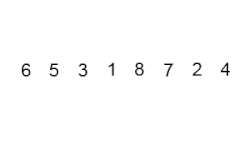

# Learn Python <!-- omit in toc -->

## Tabla de contenido: <!-- omit in toc -->

- [Introducción al Pensamiento Computacional en Python](#introducción-al-pensamiento-computacional-en-python)
  - [Aproximación de Soluciones](#aproximación-de-soluciones)
  - [Búsqueda Binaria](#búsqueda-binaria)
  - [Recursividad](#recursividad)
  - [Argumentos de otras funciones](#argumentos-de-otras-funciones)
  - [Funciones en Expresiones](#funciones-en-expresiones)
  - [Funciones en Estructuras de Datos](#funciones-en-estructuras-de-datos)
  - [Clonación](#clonación)
  - [List Comprehension](#list-comprehension)
  - [Pruebas de Caja Negra](#pruebas-de-caja-negra)
  - [Pruebas de Caja de Cristal](#pruebas-de-caja-de-cristal)
  - [Debugging](#debugging)
    - [Reglas Generales](#reglas-generales)
    - [Diseño de Experimentos](#diseño-de-experimentos)
    - [Errores Comunes](#errores-comunes)
  - [Manejo de Excepciones](#manejo-de-excepciones)
    - [Excepciones Como Control de Flujo](#excepciones-como-control-de-flujo)
  - [Afirmaciones](#afirmaciones)
- [POO](#poo)
  - [Tipos de Datos Abstractos](#tipos-de-datos-abstractos)
  - [Instancias](#instancias)
  - [Decomposición](#decomposición)
  - [Abstracción](#abstracción)
  - [Decoradores](#decoradores)
    - [Funciones Como Objetos de Primera-clase](#funciones-como-objetos-de-primera-clase)
  - [쯈ué son _getters_ y _setters_?](#qué-son-getters-y-setters)
  - [Función `property()`](#función-property)
  - [Decorador `@property`](#decorador-property)
  - [Encapsulación](#encapsulación)
  - [Herencia](#herencia)
  - [Polimorfismo](#polimorfismo)
- [Complejidad Algorítmica](#complejidad-algorítmica)
  - [Introducción a la Complejidad Algorítmica](#introducción-a-la-complejidad-algorítmica)
  - [Aproximaciones](#aproximaciones)
  - [Notación Asintótica](#notación-asintótica)
  - [Clases de Complejidad Algorítmica](#clases-de-complejidad-algorítmica)
- [Algoritmos de Búsqueda y Ordenación](#algoritmos-de-búsqueda-y-ordenación)
  - [Búsqueda Lineal](#búsqueda-lineal)
  - [Búsqueda Binaria](#búsqueda-binaria-1)
  - [Ordenamiento de Burbuja](#ordenamiento-de-burbuja)
  - [Ordenamiento por Inserción](#ordenamiento-por-inserción)
  - [Ordenamiento por Mezcla](#ordenamiento-por-mezcla)
- [Ambientes Virtuales](#ambientes-virtuales)
  - [Pip](#pip)
- [쯇or qué graficar?](#por-qué-graficar)
  - [Graficado Simple](#graficado-simple)
- [Introducción a la Optimización](#introducción-a-la-optimización)
  - [El problema del Morral](#el-problema-del-morral)
- [Estadística Computacional con Python](#estadística-computacional-con-python)
  - [Programación Dinámica](#programación-dinámica)
    - [Memoization](#memoization)
    - [Números de Fibonacci](#números-de-fibonacci)
  - [Caminos Aleatorios](#caminos-aleatorios)
    - [Camino de Borrachos](#camino-de-borrachos)
  - [Programación Estocástica](#programación-estocástica)
  - [Cálculo de Probabilidades](#cálculo-de-probabilidades)
  - [Inferencia Estadística](#inferencia-estadística)
    - [Ley de los Grandes Números](#ley-de-los-grandes-números)
    - [Falacia del Apostador](#falacia-del-apostador)
    - [Media](#media)
    - [Varianza](#varianza)
    - [Desviación Estándar](#desviación-estándar)
    - [Distribución Normal](#distribución-normal)
    - [Regla Empírica](#regla-empírica)
  - [Simulaciones de Montecarlo](#simulaciones-de-montecarlo)

## Introducción al Pensamiento Computacional en Python

```python
# <literales> = 1, 'abc', 2.0 True
# <operadores> = + / * % ** = ==
# <literal> <operador> <literal>

# <objeto> <operador> <objeto> # expresión
# >>> valor

>>> 1 + 2
>>> 1 3.0 # error sintáctico
>>> 5 / 'Platzi' # error semántico estático
>>> 5 * 'Platzi'

# statement o enunciado
>>> print('hello, Platzi!')
```

### Aproximación de Soluciones

- Similar a enumeración exhaustiva, pero no necesita una respuesta exacta
- Podemos aproximar soluciones con un margen de error que llamaremos epsilon

### Búsqueda Binaria

- Cuando la respuesta se encuentra en un conjunto ordenado, podemos utilizar búsqueda binaria
- Es altamente eficiente, pues corta el espacio de búsqueda en dos por cada iteración

### Recursividad

- Algorítmica: Una forma de crear soluciones utilizando el principio de "divide y vencerás"
- Programática: Una técnica programática mediante la cual una función se llama a sí misma

### Argumentos de otras funciones

Las funciones también pueden recibir funciones como argumentos para crear abstracciones más poderosas.

```python
def multiplicar_por_dos(n):
    return n * 2


def aplicar_operacion(f, numeros):
    resultados = []
    for numero in numeros:
        resultado = f(numero)
        resultado.append(resultado)

>>> nums = [1, 2, 3]
>>> aplicar_operaciones(multiplicar_por_dos, nums)
[2, 4, 6]
```

### Funciones en Expresiones

Una forma de definir una función en una expresión es utilizando el keyword `lambda`. lambda tiene la siguiente sintaxis: `lambda <vars>: <expresion>`.

Otro ejemplo interesante es que las funciones se pueden utilizar en una expresión directamente. Esto es posible ya que como lo hemos platicado con anterioridad, en Python las variables son simplemente nombres que apuntan a un objeto (en este caso a una función).

```python
sumar = lambda x, y: x + y

>>> sumar(2, 3)
5
```

### Funciones en Estructuras de Datos

Las funciones también se pueden incluir en diversas estructuras que las permiten almacenar. Por ejemplo, una lista puede guardar diversas funciones a aplicar o un diccionario las puede almacenar como valores.

```python
def aplicar_operaciones(num):
    operaciones = [abs, float]

    resultado = []
    for operacion in operaciones:
        resultado.append(operacion(num))

    return resultado

>>> aplicar_operaciones(-2)
[2, -2.0]
```

### Clonación

- Casi siempre es mejor clonar una lista en vez de mutarla
- Para clonar una lista podemos utilizar rebanadas (slices) o la función `list`

### List Comprehension

- Es una forma concisa de aplicar operaciones a los valores de una secuencia
- También se pueden aplicar condiciones para filtrar

### Pruebas de Caja Negra

- Se basan en la especificación de la función o el programa
- Prueba inputs y valida outputs
- _Unit testing_ o _integration testing_

### Pruebas de Caja de Cristal

- Se basan en el flujo del programa
- Prueba todos los caminos posibles de una función. Ramificaciones, bucles for y while, recursión.
- _Regression testing_ o _mocks_

### Debugging

#### Reglas Generales

- No te molestes con el debugger. Aprende a utilizar el _`print` statement_
- Estudia los datos disponibles
- Utiliza los datos para crear hipótesis y experimentos. Método científico
- Ten una mente abierta. Si entendieras el programa, probablemente no habrían bugs
- Lleva un registro de lo que has tratado, preferentemente en la forma de tests

#### Diseño de Experimentos

- Debugear es un proceso de búsqueda. CAda prueba debe acotar el espacio de búsqueda
- Búsqueda binaria con _`print` statements_

#### Errores Comunes

- Encuentra a los sospechosos comunes
- En lugar de preguntarte por qué un programa no funciona, pregúntate por qué está funcionando de esta manera
- Es posible que el bug no se encuentre donde crees que está
- Explícale el problema a otra persona. De preferencia que no tenga contexto
- Lleva un registro de lo que has tratado, preferentemente en la forma de tests
- Vete a dormir

### Manejo de Excepciones

- Son muy comunes en la programación. No tienen nada de excepcional
- Las excepciones de Python normalmente se relacionan con errores de semántica
- Se pueden crear excepciones propias
- Cuando una excepción no se maneja (unhandled exception), el programa termina en error
- Las excepciones se manejan con los keywords: `try`, `except`, `finally`
- Se pueden utilizar también para ramificar programas
- No deben manejarse de manera silenciosa (por ejemplo, con _`print` statements_)
- Para aventar tu propia excepción utiliza el keyword `raise`

#### Excepciones Como Control de Flujo

**EAFP** (_easier to ask for forgiveness than permission_, _es más fácil pedir perdón que permiso_)

El principio EAFP es un estilo de programación común en Python en el cual se asumen llaves, índices o atributos válidos y se captura la excepción si la suposición resulta ser falsa. Es importante resaltar que otros lenguajes de programación favorecen el principio:

**LBYL** (_look before you leap_, _revisa antes de saltar_)

En el cual el código verifica de manera explícita las precondiciones antes de realizar llamadas.

**Ejemplo:**

```python
# Python

def busca_pais(paises, pais):
    """
    Países es un diccionario. País es la llave.
    Código con el principio EAFP.
    """

    try:
        return paises[pais]
    except KeyError:
        return None
```

```javascript
# Javascript

/**
 * Países es un objeto. País es la llave.
 * Código con el principio LBYL.
 */

function buscaPais(paises, pais) {
  if(!Object.keys(paises).includes(pais)) {
    return null;
  }

  return paises[pais];
}
```

Como puedes ver, el código de Python accede directamente a la llave y únicamente si dicho acceso falla, entonces se captura la excepción y se provee el código necesario. En el caso de JavaScript, se verifica primero que la llave exista en el objeto y únicamente con posterioridad se accede.

Es importante resaltar que ambos estilos pueden utilizarse en Python, pero el estilo EAFP es mucho más "pythonico".

### Afirmaciones

- Programación defensiva
- Pueden utilizarse para verificar que los tipos sean correctos en una función
- También sirven para debuguear

```python
# assert <expresion booleana>, <mensaje de error>

def primera_letra(lista_de_palabras):
    primeras_letras = []

    for palabra in lista_de_palabras:
        assert type(palabra) == str, f'{palabra} no es str'
        assert len(palabra) > 0, 'No se permiten str vacíos'

        primeras_letras.append(palabra[0])

    return primeras_letras
```

## POO

### Tipos de Datos Abstractos

- En Python todo es un objeto y tiene un tipo
  - Representación de datos y formas de interactuar con ellos
- Formas de interactuar con un objeto:
  - Creación
  - Manipulación
  - Destrucción
- Ventajas:
  - Decomposición
  - Abstracción
  - Encapsulación

**Ejemplo:**

```python
# Definición de clase

class <nombre_de_la_clase>(<super_clase>):

    def __init__(self, <params>):
        <expresion>

    def <nombre_del_metodo>(self, <params>):
        <expresion>
```

```python
# Definición
class Persona:

    def __init__(self, nombre, edad):
      self.nombre = nombre
      self.edad = edad

    def saluda(self, otra_persona):
      return f'Hola {otra_persona.nombre}, me llamo {self.nombre}.'

# Uso
>>> david = Persona('David', 35)
>>> erika = Persona('Erika', 32)

>>> david.saluda(erika)
'Hola Erika, me llamo David'
```

### Instancias

- Mientras que la clase es un molde, a los objetos creados se les conoce como instancias
- Cuando se crea una instancia, se ejecuta el método `__init__`
- Todos los métodos de una clase reciben implícitamente como primer parámetro `self`
- Los atributos de clase nos permite:
  - Representar datos
  - Procedimientos para interactuar con los mismos (métodos)
  - Mecanismos para esconder la representación interna
- Se accede a los atributos con la notación de punto
- Puede tener atributos privados. Por convención comienzan con _

### Decomposición

- Partir un problema en problemas más pequeños
- Las clases permiten crear mayores abstracciones en forma de componentes
- Cada clase se encarga de una parte del programa se vuelve más fácil de mantener

### Abstracción

- Enfocarnos en la información relevante
- Separar la información central de los secundarios
- Podemos utilizar variables y métodos (privados o públicos)

### Decoradores

#### Funciones Como Objetos de Primera-clase

Otro concepto importante a tener en cuenta es que en Python las funciones son objetos de primera-clase, es decir, que pueden ser pasados y utilizados como argumentos al igual que cualquier otro objeto (strings, enteros, flotantes, listas, etc.).

**Ejemplo:**

```python
def presentarse(nombre):
  return f'Me llamo {nombre}'


def estudiemos_juntos(nombre):
  return f'Hey {nombre}, aprendamos Python!'


def consume_funciones(funcion_entrante):
  return funcion_entrante('David')


>>> consume_funciones(presentarse)
'Me llamo David'

>>> consume_funciones(estudiemos_juntos)
'Hey David, aprendamos Python!'
```

### 쯈ué son _getters_ y _setters_?

A diferencia de otros lenguajes de programación, en Python los getters y setters tienen el objetivo de asegurar el encapsulamiento de datos. Cómo habrás visto, si declaramos una variable privada en Python al colocar un guión bajo al inicio de esta (_) y normalmente son utilizados para: añadir lógica de validación al momento de obtener y definir un valor y, para evitar el acceso directo al campo de una clase.

**Clases sin _getters_ y _setters_:**
Veamos un ejemplo con una clase que almacena un datos de distancia recorrida en millas (mi) y lo convierte a kilómetros (km)

```python
class Millas:

    def __init__(self, distancia=0):
        self.distancia = distancia

    def convertir_a_kilometros(self):
        return (self.distancia * 1.609344)


# Creamos un nuevo objeto
avion = Millas()

# Indicamos la distancia
avion.distancia = 200

# Obtenemos el atributo distancia
>>> print(avion.distancia)
200

# Obtenemos el método convertir_a_kilometros
>>> print(avion.convertir_a_kilometros)
321.8688
```

**Utilizando _getters_ y _setters_:**
Incluyamos un par de métodos para obtener la distancia y otro para que no acepte valores inferiores a cero, pues no tendría sentido que un vehículo recorra una distancia negativa. Estos son métodos getters y setters.

```python
class Millas:

    def __init__(self, distancia=0):
        self.distancia = distancia

    def convertir_a_kilometros(self):
        return (self.distancia * 1.609344)

    # Método getter
    def obtener_distancia(self):
        return self._distancia

    # Método setter
    def definir_distancia(self, valor):
        if valor < 0:
            raise ValueError('No es possible convertir distancias menores a 0.')
        self._distancia = valor
```

El método getter obtendrá el valor de la distancia que y el método setter se encargará de añadir una restricción. También debemos notar cómo distancia fue reemplazado por _distancia, denotando que es una variable privada.

### Función `property()`

Esta función está incluida en Python, en particular crea y retorna la propiedad de un objeto. La propiedad de un objeto posee los métodos `getter()`, `setter()` y `del()`.

En tanto la función tiene cuatro atributos: `property(fget, fset, fdel, fdoc):`

- fget: trae el valor de un atributo.
- fset: define el valor de un atributo.
- fdel: elimina el valor de un atributo.
- fdoc: crea un docstring por atributo.

**Implementación usando `property()`:**

```python
class Millas:

    def __init__(self):
        self.distancia = 0

    # Función para obtener el valor de _distancia
    def obtener_distancia(self):
        print('Llamada al método getter')
        return self._distancia

    # Función para definir el valor de _distancia
    def definir_distancia(self, recorrido):
        print('Llamada al método setter')
        self._distancia = recorrido

    # Función para eliminar el atributo _distancia
    def eliminar_distancia(self):
        del self._distancia

    distancia = property(obtener_distancia, definir_distancia, eliminar_distancia)


# Creamos un nuevo objeto
avion = Millas()

# Indicamos la distancia
avion.distancia = 200

# Obtenemos su atributo distancia
>>> print(avion.distancia)
Llamada al método getter
Llamada al método setter
200
```

### Decorador `@property`

Este decorador es uno de varios con los que ya cuenta Python, el cual nos permite utilizar getters y setters para hacer más fácil la implementación de la programación orientada a objetos en Python cambiando los métodos o atributos de las clases de forma que no modifiquemos el código.

**Ejemplo:**

```python
class Millas:

    def __init__(self):
        self.distancia = 0

    # Función para obtener el valor de _distancia
    # Usando el decorador property
    @property
    def obtener_distancia(self):
        print('Llamada al método getter')
        return self._distancia

    # Función para definir el valor de _distancia
    @obtener_distancia.setter
    def definir_distancia(self, valor):
        if valor < 0:
            raise ValueError('No es possible convertir distancias menores a 0.')
        print('Llamada al método setter')
        self._distancia = valor


# Creamos un nuevo objeto
avion = Millas()

# Indicamos la distancia
avion.distancia = 200

# Obtenemos su atributo distancia
>>> print(avion.definir_distancia)
Llamada al método getter
Llamada al método setter
200
```

### Encapsulación

- Permite agrupar datos y su comportamiento
- Controla el acceso a dichos datos
- Previene modificaciones no autorizadas

### Herencia

- Permite modelar una jerarquía de clases
- Permite compartir comportamiento común en la jerarquía
- Al padre se le conoce como superclase y al hijo como subclase

### Polimorfismo

- La habilidad de tomar varias formas
- En Python, nos permite cambiar el comportamiento de una superclase para adaptarlo a la subclase

## Complejidad Algorítmica

### Introducción a la Complejidad Algorítmica

- 쯇or qué comparamos la eficiencia de un algoritmo?
- Complejidad temporal vs complejidad espacial
- Podemos definirla como T(n)

### Aproximaciones

- Cronometrar el tiempo en el que corre un algoritmo 🤨
- Contar los pasos con una medida abstracta de operación 🙂
- Contar los pasos conforme nos aproximamos al infinito 😃

### Notación Asintótica

- No importan variaciones pequeñas
- El enfoque se centra en lo que pasa conforme el tamaño del problem se acerca al infinito
- Mejor de los casos, promedio, peor de los casos
- Big O
- Nada más importan el término de mayor tamaño

### Clases de Complejidad Algorítmica

- O(1) Constante
- O(n) Lineal
- O(log n) Logarítmica
- O(n log n) log Lineal
- O(n**2) Polinomial
- O(2**n) Exponencial


## Algoritmos de Búsqueda y Ordenación

### Búsqueda Lineal

- Busca en todos los elementos de manera secuencial
- 쮺uál es el peor caso?

### Búsqueda Binaria

- Divide y conquista
- El problema se divide en 2 en cada iteración
- 쮺uál es el peor caso?

### Ordenamiento de Burbuja

Es un algoritmo que recorre repetidamente una lista que necesita ordenarse. Compara elementos adyacentes y los intercambia si están en el orden incorrecto. Este procedimiento se repite hasta que no se requiere mas intercambios, lo que indica que la lista se encuentra ordenada.



### Ordenamiento por Inserción

En este algoritmo se ordena "en su lugar", es decir que no se crea un a nueva lista con los elementos ordenados si no que en lugar de eso se
modifican los valores en memoria.


### Ordenamiento por Mezcla

El ordenamiento por mezcla es un algoritmo de divide y conquista. Primero divide una lista en partes iguales hasta que quedan sublistas de
1 o 0 elementos. Luego las recombina en forma ordenada.


## Ambientes Virtuales

- Permiten aislar el ambiente para poder instalar diversas versiones de paquetes
- A partir de Python 3 se incluye en la librería estándar en el módulo venv
- Ningún ingeniero profesional de Python trabaja sin ellos

**Ejemplo:**

```bash
# Para generar nuestro ambiente virtual escribimos en terminal
python -m venv env

# Activamos nuestro ambiente virtual
source env/bin/activate

# Para salir de nuestro ambiente virtual
deactivate
```

### Pip

- Permite descargar paquetes de terceros para utilizar en nuestro programa
- Permite compartir nuestros paquetes con terceros
- Permite especificar la versión del paquete que necesitamos

## 쯇or qué graficar?

- Reconocimiento de patrones
- Predicción de una serie
- Simplifica la interpretación y las conclusiones acerca de los datos

### Graficado Simple

- Bokeh permite construir gráficas complejas de manera rápida y con comando simples
- Permite exportar a varios formatos como html, notebooks, imágenes, etc
- Bokeh se puede utilizar en el servidor con Flask y Django

## Introducción a la Optimización

- El concepto de optimización permite resolver muchos problemas de manera computacional
- Una función objetivo que debemos maximizar o minimizar
- Una serie de limitantes que debemos respetar

### El problema del Morral


## Estadística Computacional con Python

### Programación Dinámica

- **Subestructura Óptima.** Una solución global óptima se puede encontrar al combinar soluciones óptimas de subproblemas locales
- **Problemas empalmados.** Una solución óptima que involucra resolver el mismo problema en varias ocasiones

#### Memoization

- La _Memorización_ es una técnica para guardar cómputos previos y evitar realizarlos nuevamente
- Normalmente se utiliza un diccionario, donde las consultas se pueden hacer en O(1)
- Intercambia tiempo por espacio

#### Números de Fibonacci

NOTA: Para poder ver las formulas matemáticas es necesario instalar la siguiente extensión: [xhub](https://chrome.google.com/webstore/detail/xhub/anidddebgkllnnnnjfkmjcaallemhjee/related)

La serie de _Fibonacci_ se representa como:

```math
F_{n}=F_{n-1}+F_{n-2}
```


### Caminos Aleatorios

- Es un tipo de simulación que elige aleatoriamente una decisión dentro de un conjunto de decisiones válidas
- Se utiliza en muchos campos del conocimiento cuando los sistemas no son deterministas e incluyen elementos de aleatoriedad

#### Camino de Borrachos


### Programación Estocástica

- Un programa es determinístico si cuando se corre con el mismo _input_ produce el mismo _output_
- Los programas determinísticos son muy importantes, pero existen problemas que no pueden resolverse de esa manera
- La programación estocástica permite introducir aleatoriedad a nuestros programas para crear simulaciones que permiten resolver otro tipo de problemas
- Los programas estocásticos se aprovechan de que las distribuciones probabilísticas de un problema se conocen o puede ser estimadas

### Cálculo de Probabilidades

- La probabilidad es una mediad e la certidumbre asociada a un evento o suceso futuro y suele expresarse como un número entre 0 y 1
- Una probabilidad de 0 significa que un suceso jamás sucederá
- Una probabilidad de 1 significa que un suceso está garantizado de suceder en el futuro

----

- **Ley del complemento:** $`P(A) + P(~A) = 1`$
- **Ley multiplicativa:** $`P(A y B) = P(A) * P(B)`$
- **Ley aditiva (mutuamente exclusivos):** $`P(A o B) = P(A) + P(B)`$
- **Ley aditiva (no exclusivos):** $`P(A o B) = P(A) + P(B) - P(A y B)`$

### Inferencia Estadística

- Con las simulaciones podemos calcular las probabilidades de eventos complejos sabiendo las probabilidades de eventos simples
- 쯈ué pasa cuando no sabemos las probabilidades de los eventos simples?
  - Las técnicas de la Inferencia Estadística nos permiten inferir/concluir las propiedades de una población a partir de una muestra **aleatoria**.

_"El principio guía de la Inferencia Estadística es que una muestra aleatoria tiende a exhibir las
mismas propiedades que la población de la cual fue extraída"_ - John Guttag

#### Ley de los Grandes Números

En pruebas independientes repetidas con la misma probabilidad $`P`$ de un resultado, la fracción de desviaciones de $`P`$
converge a cero conforme las cantidades de pruebas se acercan al infinito.

```math
P(\lim\limits_{n \to\infty} \overline{X}_n = \mu) = 1
```

#### Falacia del Apostador

- La falacia del apostador señala que después de un evento extremo, ocurrirán eventos menos extremos para nivelar la media
- La _regresión a la media_ señala que después de un evento aleatorio extremo, el siguiente evento probablemente será menos extremo

#### Media

- Es una medida de tendencia central
- Comúnmente es conocida como el promedio
- La media de una población se denota con el símbolo $`\mu`$. La media de una muestra se denota con $`\overline{X}`$

```math
\overline{x} = \frac{1}{n}\displaystyle\sum_{i=1}^{n}x_i = \frac{x_1 + x_2 + \cdots + x_n}{n}
```

#### Varianza

- La varianza mide qué tan propagados se encuentran un conjunto de valores aleatorios de su media
- Mientras que la media nos da una idea de dónde se encuentran los valores, la varianza nos dice que tan dispersos se encuentran
- La varianza siempre debe entenderse con respecto a la media

```math
Var(X) = \frac{1}{n}\displaystyle\sum_{i=1}^{n}(x_i - \mu)^2
```

#### Desviación Estándar

- La desviación estándar es la raíz cuadrada de la varianza
- Nos permite entender, también, la propagación y se debe entender siempre relacionado a la media
- La ventaja sobre la varianza es que la desviación estándar está en las mismas unidades que la media

```math
\sigma = \sqrt{\displaystyle\sum_{i=1}^{N}p_i(x_i - \mu)^2}
```

#### Distribución Normal

- Es una de las distribuciones más recurrentes en cualquier ámbito
- Se define completamente por su media y su desviación estándar
- Permite calcular intervalos de confianza con la regla empírica

```math
f(x) = \frac{1}{\sigma\sqrt{2\pi}}e^{-\frac{1}{2}(\frac{x-\mu}{\sigma})^2}
```

#### Regla Empírica

- También conocida como la regla 68-95-99.7
- Señala cuál es la dispersión de los datos en una distribución normal a uno, dos y tres sigmas
- Permite calcular probabilidades con la densidad de la distribución normal

```math
Pr(\mu - 1\sigma \leq X \leq \mu + 1\sigma) \approx 0.6827 \\
Pr(\mu - 2\sigma \leq X \leq \mu + 2\sigma) \approx 0.9545 \\
Pr(\mu - 3\sigma \leq X \leq \mu + 3\sigma) \approx 0.9973
```

### Simulaciones de Montecarlo

- Permite crear simulaciones para predecir el resultado de un problema
- Permite convertir problemas determinísticos en problemas estocásticos
- Es utilizado en una gran diversidad de áreas, desde la ingeniería hasta la biología y el derecho
